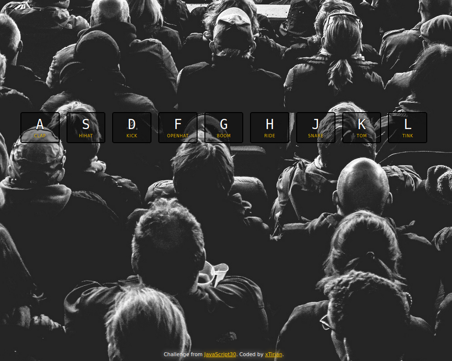

# JS - Drum Kit

This is a solution from [JS Drum Kit Challenge](https://javascript30.com/). JavaScript30 is a chain of challenges that help you improve your coding and problem solving skills with JS. 

## Table of contents

- [Overview](#overview)
- [Screenshot](#screenshot)
- [Links](#links)
- [My process](#my-process)
- [Built with](#built-with)
- [What I learned](#what-i-learned)
- [Continued development](#continued-development)
- [Useful resources](#useful-resources)
- [Author](#author)
- [Acknowledgments](#acknowledgments)

## Overview

This challenge was divided in t

### Screenshot

### Links

- Solution URL: [Add solution URL here](https://your-solution-url.com)
- Live Site URL: [Add live site URL here](https://your-live-site-url.com)

## My process

### Built with
- JavaScript
- Event Listener
- Audio DOM Manipulation

### What I learned

### Continued development

### Useful resources

- [Introduction to Keyboard Events in JavaScript](https://www.section.io/engineering-education/keyboard-events-in-javascript/)
- [Using data attributes](https://developer.mozilla.org/en-US/docs/Learn/HTML/Howto/Use_data_attributes)

## Author

## Acknowledgments