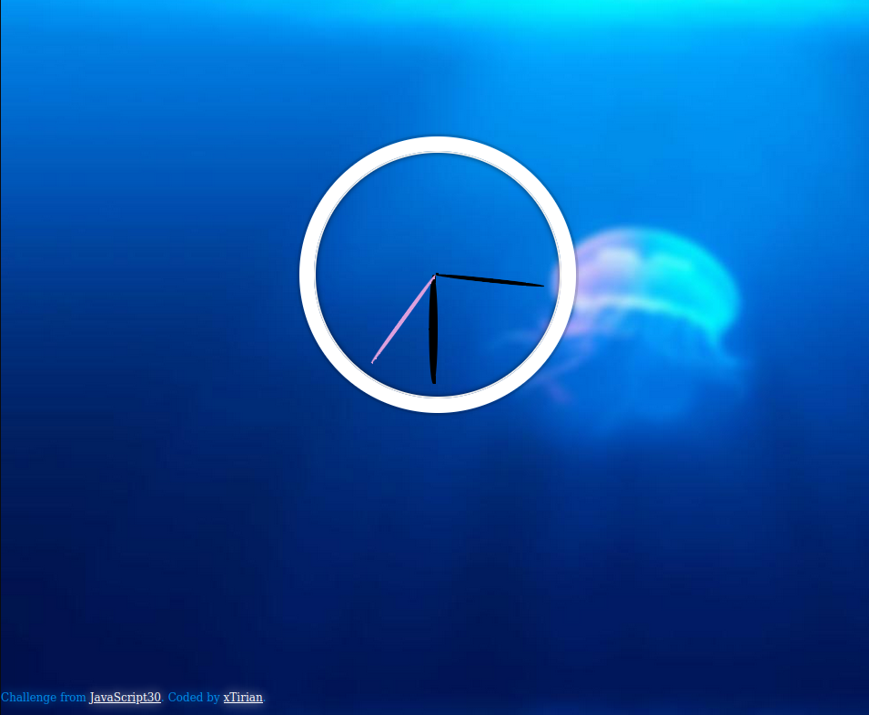

# JS - Drum Kit

This is a solution from [JS + CSS Clock Challenge](https://javascript30.com/). JavaScript30 is a chain of challenges that help you improve your coding and problem solving skills with JS.

## Table of contents

- [Overview](#overview)
- [Screenshot](#screenshot)
- [Links](#links)
- [My process](#my-process)
- [Built with](#built-with)
- [What I learned](#what-i-learned)
- [Useful resources](#useful-resources)
- [Author](#author)

## Overview

A clock builded with CSS and animeted with JS

### Screenshot



### Links

- Solution URL: [Git Repository](https://github.com/xtirian/JS30-TheForceAwakens/tree/main/01%20-%20JavaScript%20Drum%20Kit)
- Live Site URL: [🔥 JS Drum Kit](https://js-clock-rust.vercel.app/)

## My process

### Built with

- JavaScript
- Event Listener KeyPress
- Audio DOM Manipulation

### What I learned

I always like to wrote in a paper what I thought that would be the algorithm behind the funcionality, and I divided this in three parts:

- identify the keyboard keys pressed
- play the current sound
- change the current div that is pressed

The first thing I learned was the "data-*" attribute.

```html
<div data-key="97" class="key">
  <kbd>A</kbd>
  <span class="sound">clap</span>
</div>
<!-- ... -->
<audio data-key="97" src="sounds/clap.wav"></audio>
```

It was easy to see that I could use this information to uniform the data. So, I just had to identify the keyboard key and associate this to an audio and a div with the same data-key.

The problem I found was that the data-key in the starter-pack didn't work in my PC. So I searched for a way to discover the key codes and found out the "keyCode" property. So in my event listener I wrote:

```js
document.addEventListener("keypress", (event) => {
  var code = event.keyCode;
  console.log(code);
});
```

and pick the codes from the console. So with the right codes I changed the HTML and my event listener worked well. With this info I started the second part, that is play the sound.
1- This part was kind easy, I selected all the sounds with the query selector and created an Array with all the querys
2- I used the Array.filter() to look inside the querys what query had the same data-key that was pressed and identified by the listener. To do that I had to call the "dataset" property.

```js
function playSound(keyCode) {
  let allSounds = [
   //An Array of <audio data-key="97" src="sounds/clap.wav"></audio>
  ]
  let selectedSound = allSounds.filter(sound => (sound.dataset.key == keyCode));
}

 //Added the load() to every time I press the key, the it restart the sound and play again, so I can press repeatedly. 
selectedSound[0].load()
selectedSound[0].play()
```
3- To finish, I took the key code and called the function that changes the classes to give the light effect. The logic behind the filter was the same for me so I just had to add the class "playing" to this element to change his style. But I faced one problem, when I pressed a Key onceone time, the style changed static and didn't came back. So I thought the better solution was put a time out that, every time the function was called and the "playing" style was added, 100 milisecods after, the "playing" style should removed. So I add and remove the class to create an effect like the "button-selector:active" in the CSS.

```js
function lightUpKey(keyCode) {
      const allDivs = [
       // Array of divs <div data-key="97" class="key"> ...
      ]
      
      let selectedDiv = [
       //returned an array with only the div with the keyCode <div data-key="97" class="key">
      ]

      selectedDiv[0].classList.add('playing')

      setTimeout(() => { selectedDiv[0].classList.remove('playing') }, 100)

    }
```
### Useful resources

- [Article - Introduction to Keyboard Events in JavaScript](https://www.section.io/engineering-education/keyboard-events-in-javascript/)
- [Documentation - Using data attributes](https://developer.mozilla.org/en-US/docs/Learn/HTML/Howto/Use_data_attributes)

## Author

- Linkedin - [Clique aqui](https://www.linkedin.com/in/mf-cunha/x)
- GitHub - [Clique aqui](https://github.com/xtirian/)

